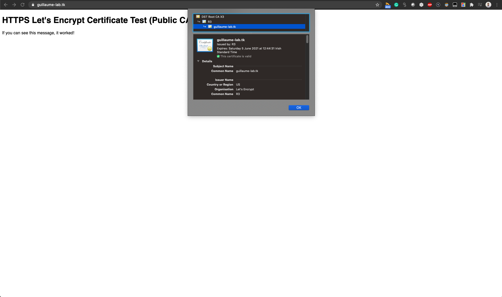

# ansible-https-public-ca
* Deployment of a certificate signed by a public CA (using Certbot)
* Deployment of Nginx on an AWS Ubuntu VM (20.04)
* Configuration of Nginx to use the certificate
* Using Ansible playbook. 

Tested with the following versions: 
* Ansible 2.10.5
* Ubuntu (20.04) 

# Prerequisite: 
* Ansible
* Ansible galaxy
* A VM accessible from the internet (tested on AWS EC2 - micro t2.micro - Ubuntu [20.04])
* The VM needs to be accessible through a name (tested regestering a name with `freenom.com`).

# Installation: 
```
ansible-galaxy install -r requirements.yml
ansible-playbook -i inventory.yml provision.yml
```

The certificate is automatically renewed using a cron job: 
```
ubuntu@ip-172-31-3-137:~$ crontab -l
#Ansible: Certbot automatic renewal.
30 3 * * * certbot renew --quiet --no-self-upgrade
```

We should have the Nginx web server GUI available when visiting the web server. The certificate is used by the nginx server.


